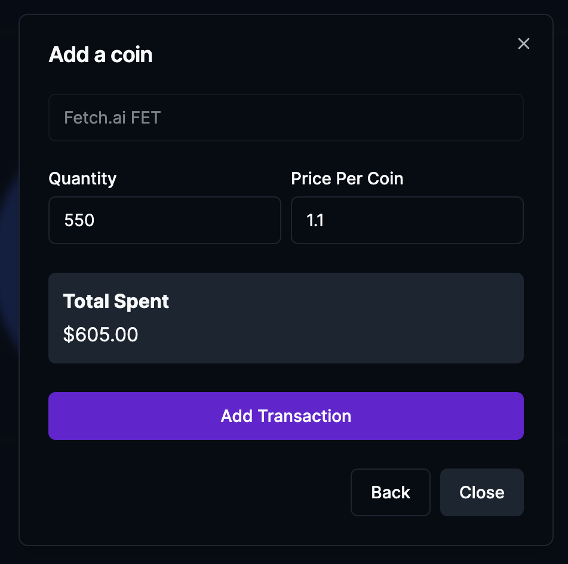
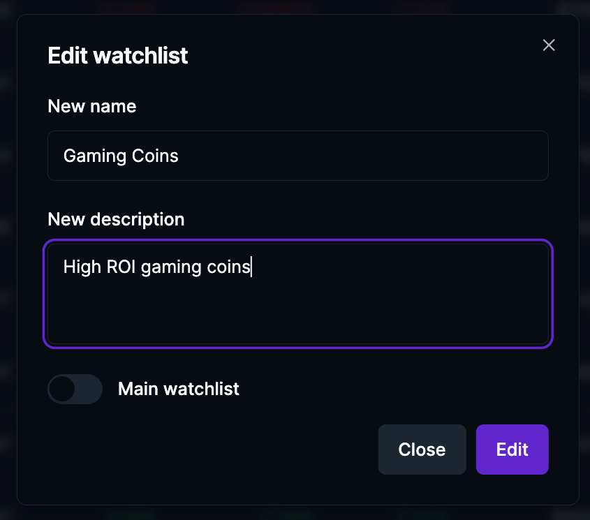

# Crypto Wallet

[Live Website](https://crypto-wallet-livid.vercel.app/)

## Stack
- Next.js (Frontend + Backend)
- React Context API (State Management)
- shadcn/ui (UI Styling)
- MongoDB (Database)
- Vercel (Deployment)

## Features
- Google & GitHub authentication (using next-auth)
  
- Monitor the most popular cryptocurrencies (price, price change, market cap, volume & circulating supply)
  
- Portfolios management (create, delete, add transactions, allocation, account goal)
  
  
- Watchlists management (create, edit, delete, add/remove coins)
  
  
- Coins overview (total quantity owned, average buy price, total profit/loss, transactions)
  
