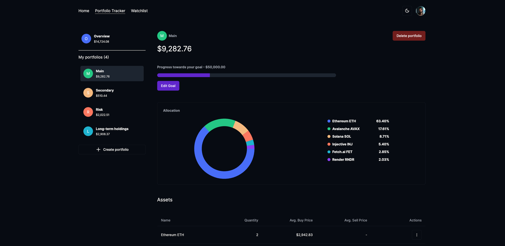

   
  

## 📋 <a name="table">Table of Contents</a>

1. 🤖 [Introduction](#introduction)
2. ⚙️ [Tech Stack](#tech-stack)
3. 🔋 [Features](#features)
4. 🤸 [Overview](#overview)

## <a name="introduction">🤖 Introduction</a>
A web application that provides users with real-time data on the most popular cryptocurrencies, allowing them to effortlessly track their favorite coins, create custom portfolios, and assemble watchlists to monitor coins of interest.

## <a name="tech-stack">⚙️ Tech Stack</a>
- Next.js (Frontend + Backend)
- React Context API (State Management)
- React Query + Axios (API Calls)
- shadcn/ui (UI Styling)
- MongoDB (Database)
- Vercel (Deployment)

## <a name="features">🔋 Features</a>
- Google & GitHub authentication (using next-auth)
- Monitor the most popular cryptocurrencies (price, price change, market cap, volume & circulating supply)
- Portfolio management (create, delete, add transactions, allocation, account goal)
- Watchlist management (create, edit, delete, add/remove coins)
- Coin overview (total quantity owned, average buy price, total profit/loss, transactions)

## <a name="overview">🤸 Overview</a>
- <b>Login Screen -></b> Start using the application effortlessly by selecting one of two providers: <b>Google</b> or <b>GitHub</b>. For new users, an account will be automatically created based on the email address.

 

- <b>Main Page -></b> Keep an eye on live data for the top 100 coins, including their prices, price changes, volume shifts, market caps, and circulating supplies.

 

- <b>Portfolio Tracker -></b> Efficiently organize your assets in portfolios, with data dynamically updating in response to your actions. The allocation of a portfolio will be displayed as a piechart, while the assets will be listed in table, with the posibility to add, remove coins or add transactions to existing holdings. Each portfolio showcases the invested amount, providing clarity on your investment allocation. The "Overview" section aggregates data from all portfolios, offering a comprehensive snapshot of your overall investment.

 

- <b>Transactions -></b> Within the application, you can access a detailed transaction history for each owned coin, encompassing both buy and sell transactions. This section presents essential information, such as the quantity of the coin owned, the average buy price, and the current total profit or loss, factoring in the latest market price of the coin.

 

- <b>Watchlist -></b> Stay updated on your favorite coins by setting up multiple watchlists. Enjoy the flexibility to add or remove coins, as well as the convenience of deleting or editing watchlists to tailor your tracking experience.

